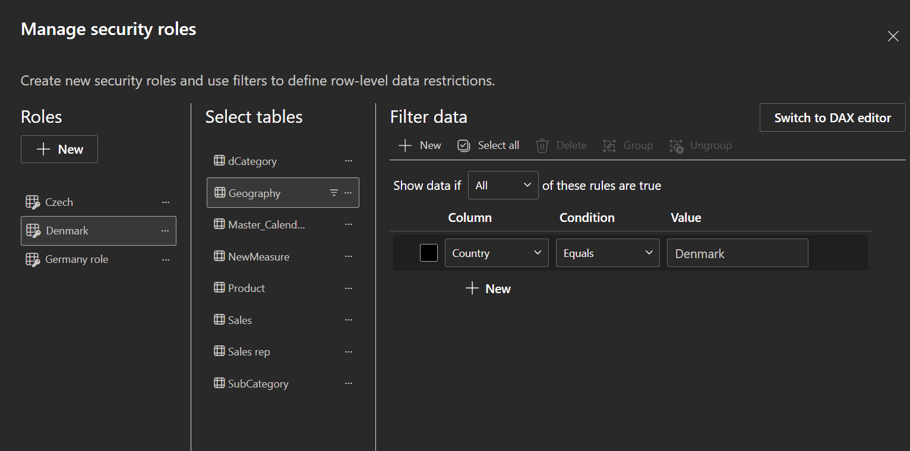
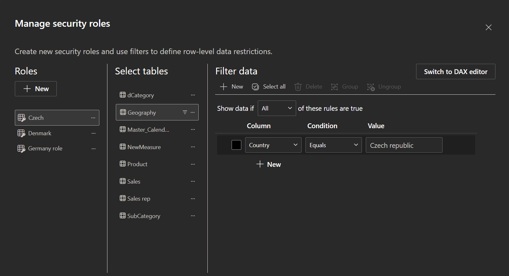
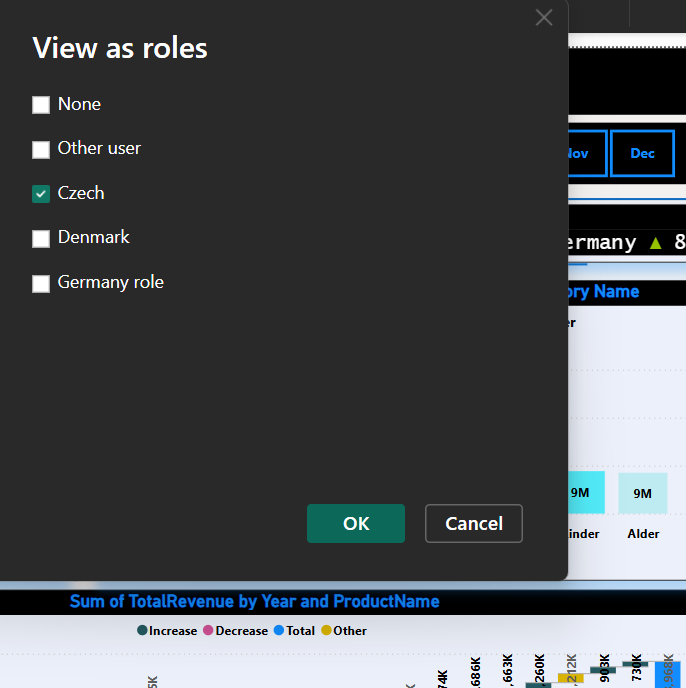
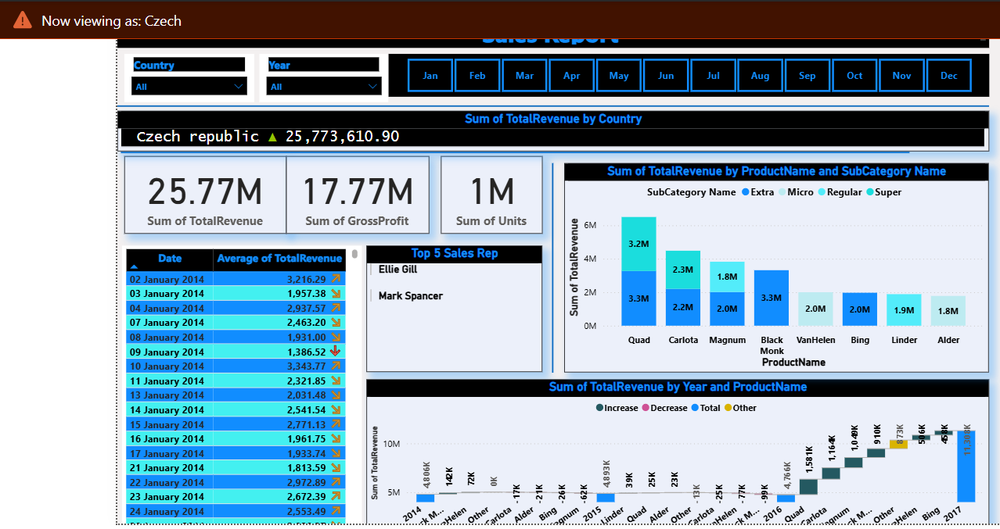

# 🛍️ Retail Sales Analysis (Power BI Dashboard)

A one-page dynamic Power BI dashboard that delivers advanced retail sales insights using multiple data sources and row-level security (RLS) logic. Built to support Quarterly Business Review (QBR) presentations with deep visual storytelling.

---
# ❗ Problem Statement 
   Retail business has raw sales data but lacks clarity on performance insights

   No visual system exists to monitor KPIs or identify sales patterns

   Management struggles with understanding product and customer trends

   Need for a centralized Power BI dashboard for actionable insights

   
   Goal: Drive better decision-making in sales, marketing, and inventory
   
---
# 🧠 BRD Questions 
What are the total sales, profit, and quantity sold over time?

Which products/categories generate the most revenue and profit?

How do sales differ by customer type (e.g., new vs returning)?

Which regions or cities perform best and worst in terms of sales?

What are the monthly/weekly/daily sales trends?

Who are the most valuable customers based on buying behavior?

Are there any peak sales periods or seasonal patterns?

---
# 🧾 Project Objective

Analyze a retail store's transactional sales data using Power BI

Identify trends in sales performance, customer behavior, and product categories

Create DAX measures to calculate KPIs like total sales, profit, and quantity sold

Develop interactive dashboards for dynamic filtering and visual exploration

Support data-driven decision-making in sales, marketing, and inventory

Highlight top-performing products, key regions, and customer segments

Enable the business to optimize pricing, stock levels, and promotional strategies

---
🎞️ **Live Dashboard Demo (GIF)**  

---

## 🔐 Row-Level Security (RLS)

RLS is implemented to restrict data visibility based on user roles (e.g., Czech, Denmark, Germany).

### ✅ Configured Roles:

| Role Name     | Filter Column | Condition | Value           | Notes                            |
|---------------|----------------|-----------|------------------|----------------------------------|
| Czech         | Country        | Equals    | Czech Republic   | ✔️ Working correctly              |
| Denmark       | Country        | Equals    | Denamrk     | ✔️ Working correctly              |
| Germany role  | Country        | Equals    | Germany          | ✔️ Valid and working              |

📸 **Screenshots of RLS setup**  
| Czech Role | Denmark Role  | View as Role | 
|------------|---------------------|----------------|
|  |  |  |

| Dashboard View as Role |
 |

---

## 📈 Key Features

### 📌 Visual Highlights

- Quarterly Sales Growth (QoQ)
- Monthly Trend Analysis
- Product Drop/Increase Trends
- Geo-wise Sales Visualization
- Category/Subcategory Breakdown
- Interactive Scroll Navigation

### 🧮 DAX Measures

- **Total Revenue** = Units × Retail Price  
- **Total Cost** = Units × Standard Cost  
- **Gross Profit** = Total Revenue − Total Cost  
- **MoM Growth %** = Gross Profit Change  
- **Average Sales/Day** = Revenue divided by active days  
- **QoQ Growth** (Time intelligence)

---

## 🧰 Tools Used

- **Power BI Desktop** (DAX, RLS, Power Query)
- **Power Query** for data transformations
- **Star Schema** for data modeling
- **Excel & CSV** as data sources

---

## 📝 Functional Scope (Based on BRD)

✅ Load yearly Sales files dynamically using folder query  
✅ Split "Location" column into Country & City  
✅ Clean SalesRep & SubCategory ID columns using reusable Power Query function  
✅ Generate and use `GeoKey` for proper table joins  
✅ Use Calendar table for time intelligence  
✅ Implement QoQ Growth & MoM Growth measures  
✅ Ensure months sort from Jan to Dec  

📄 **View Full BRD Document:** [BRD For Retail Sales (1).docx](./BRD%20For%20Retail%20Sales%20(1).docx)

---

## 📂 Project Structure

